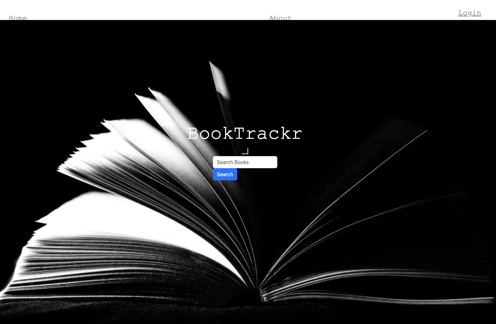
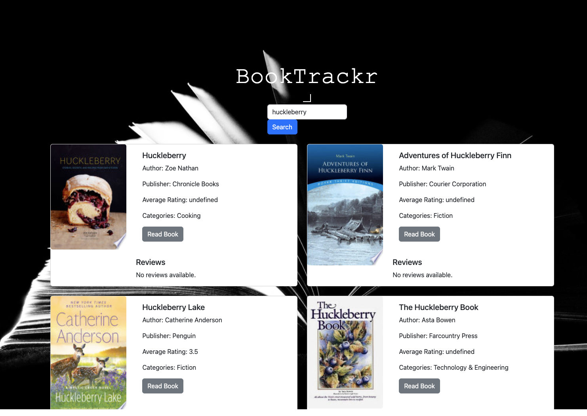

# Book Management System Group 3

## Description
  Book Management System allows users to keep track of their personal book collection. The application will provide a user-friendly interface for managing books, including adding new books, updating book details, and viewing the book collection.

## Table of Contents
  - [Tasks Completed](#taskscompleted)
  - [Installation](#installation)
  - [Usage](#usage)
  - [Tools](#tools)
  - [Features](#features)
  - [Credits](#credits)
  - [References](#references)
  - [License](#license)

## Tasks Completed
- set up the folder structure using MVC framework
  * setup Sequelize connection to database
  * created models for the application
  * setup controller files to handle different routes
  * created routes to handle different routes and mapped them to appropriate controllers
  * setup handlebars templates to render HTML views for application
  * setup client-side functionality 
  * setup the Express application, configured the necessary middleware, and defined the routes using the controllers and routes
- obtained Google Books API key to fetch book data
- implemented book search functionality

## Installation
  * Clone the respository into your local machine
       ` git clone git@github.com:nhunguyen-debug/Bookmanagement-system-Group3.git`
  * Make sure you install Node.js and NPM on your computer. 
  * You will need to use MySQL2, Sequelize, Express and dotenv. Run `npm install` to install the required dependencies.
  * Get a free API Key at https://developers.google.com/books/docs/v1/getting_started
  * Enter API Key in public > js > testapp.js var apiKey = "Enter your API Key"

## Usage
Link to deployed website - https://bookmanagement.herokuapp.com/

## Tools
- Google Books API - https://developers.google.com/books

## Features
* Node.js
* Express.js
* MySQL2
* dotenv
* Sequelize
* Google Books API - https://developers.google.com/books

## Credits
* [Thi Nguyen](https://github.com/)
* [Kyle Curry](https://github.com/)
* [Jochebed Maduagwu](https://github.com/)
* [Joshua Delves](https://github.com/)
  

## References 
* [MDN Docs on MVC](https://developer.mozilla.org/en-US/docs/Glossary/MVC)
* [Google Books API](https://developers.google.com/books/docs/v1/using)
* [Using Google Books API in your application](https://rachelaemmer.medium.com/how-to-use-the-google-books-api-in-your-application-17a0ed7fa857#:~:text=Fill%20out%20the%20information%20with,your%20own%2C%20unique%20API%20key.)

## License
The project is licensed under MIT. For more information, please refer to the LICENSE in the repo.

